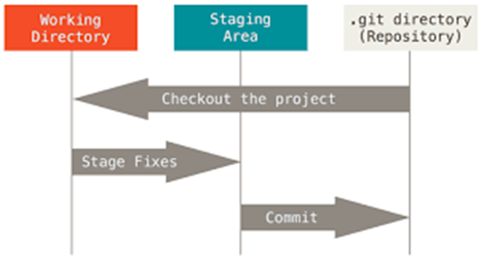
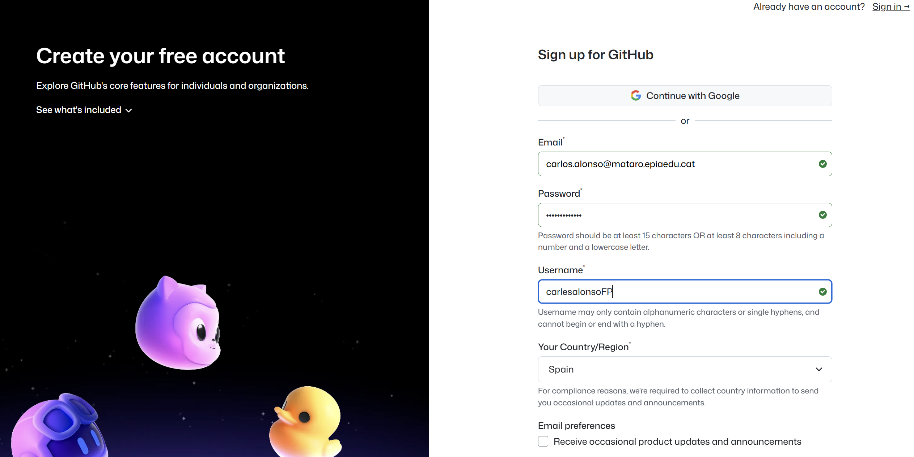
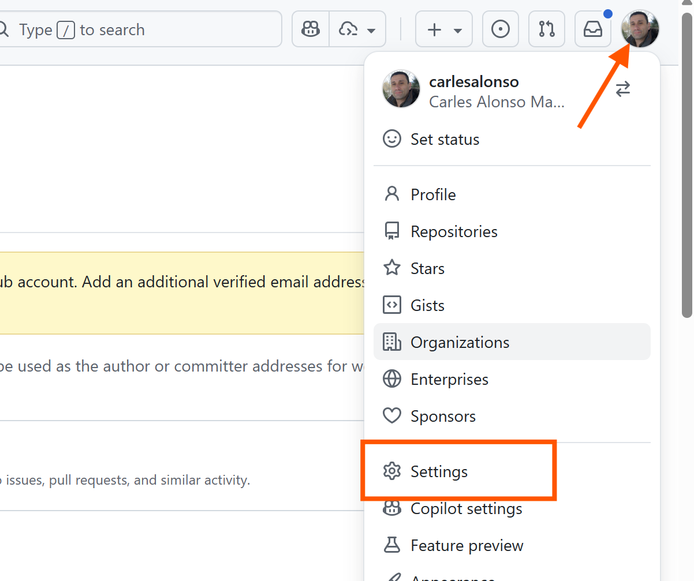
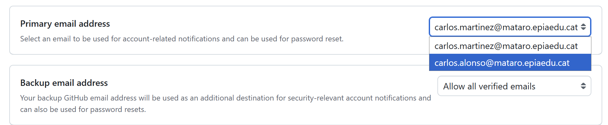
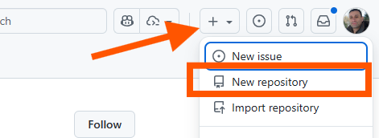
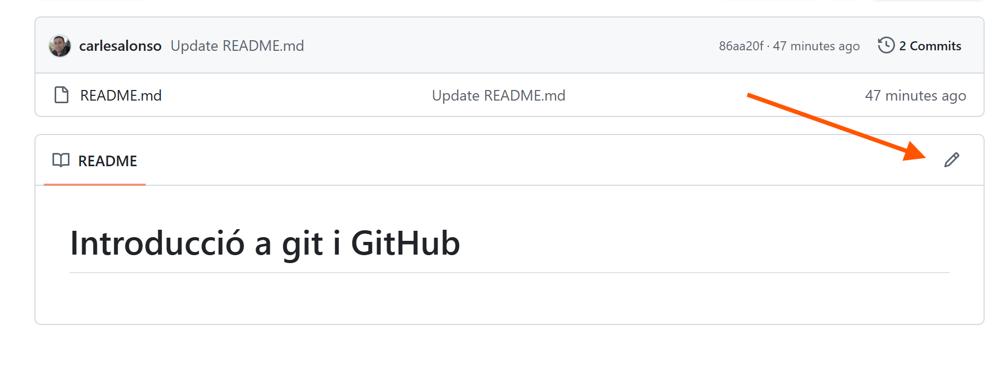
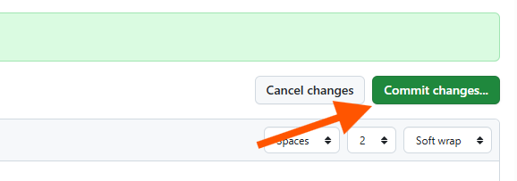

# Introducció a git i GitHub

## Introducció control de versions

El control de versions és un sistema que registra els canvis realitzats en un conjunt de fitxers al llarg del temps. Permet als desenvolupadors col·laborar en projectes, fer seguiment dels canvis i revertir a versions anteriors si és necessari. Git és un dels sistemes de control de versions més populars i utilitzats actualment.

I per què en cal un control de versions? Doncs per diversos motius:

- **Col·laboració**: Permet a diversos desenvolupadors treballar en el mateix projecte sense conflictes
- **Historial**: Permet veure l'historial de canvis realitzats en el projecte, així com qui ha realitzat cada canvi.
- **Reversió**: Permet revertir a versions anteriors del projecte si és necessari
- **Còpia de seguretat**: Permet tenir una còpia de seguretat del projecte en cas de pèrdua de dades.

No usar control de versions, provoca que per evitar problemes a l'hora de modificar arxius i no voler perdre l'estat actual, ens porta a solucions com per exemple crear carpetes per cada estat del projecte o anar reanomenant els fitxers amb dates i hores, que són poc pràctiques i poden portar a errors i confusions.

## Git

Tot i que Git no va ser el primer sistema de control de versions, sí que va ser el primer que va permetre treballar de manera distribuïda, és a dir, cada desenvolupador té una còpia completa del projecte i de l'historial de canvis al seu ordinador. De fet, el seu creador va ser Linus Torvalds, el creador del nucli Linux, que necessitava un sistema de control de versions per al desenvolupament del nucli.

El protocol git està disponible en molts sistemes operatius, com ara Linux, macOS i Windows. A més, hi ha moltes interfícies gràfiques i eines que faciliten l'ús de Git, com ara GitKraken, Sourcetree, etc. si no voleu utilitzar la línia de comandes. La major part d'editor de codi, com ara Visual Studio Code, tenen integració amb Git, de manera que tampoc cal instal·lar eines addicionals.

### Tinc git al meu ordinador?

En equips amb Linux o macOS, és probable que ja tingueu Git instal·lat. Podeu comprovar-ho obrint una terminal i escrivint la comanda següent:

```bash
git --version
```

Si Git està instal·lat, veureu la versió de Git que teniu instal·lada. Si no està instal·lat, veureu un missatge d'error indicant que la comanda no es troba.

En equips amb Windows, és probable que no tingueu Git instal·lat. Podeu descarregar-lo des de la pàgina oficial de [Git](https://git-scm.com/download/win). Un cop descarregat, executeu l'instal·lador i seguiu les instruccions per a instal·lar Git al vostre ordinador. També el podeu instal·lar mitjançant el gestor de paquets `Winget` amb la comanda següent:

```Powershell
winget install Git
```

### Conceptes bàsics de Git

Tot i que de moment només farem servir Git a través de la interfície web de GitHub, és interessant conèixer alguns conceptes bàsics de Git.

- **Repositori**: És el lloc on es guarda el projecte i l'historial de canvis. Pot ser local (al vostre ordinador) o remot (a un servidor com GitHub).
- **Commit**: És una instantània del projecte en un moment concret. Cada commit té un identificador únic i un missatge descriptiu dels canvis realitzats.

A l'hora de treballar amb Git, hi ha tres estats principals:

- **Directori de treball (Working Directory)**: És on es troben els fitxers del projecte al vostre ordinador. Podeu modificar els fitxers en aquest estat.
- **Àrea d'escenari (Staging Area)**: És on es preparen els fitxers per a ser inclosos en el proper commit.
- **Repositori (Repository)**: És on es guarden els commits. Un cop un fitxer està en el repositori, forma part de l'historial de canvis.



Això vol dir que quan modifiqueu un fitxer al directori de treball, primer heu de preparar-lo per a ser inclòs en el proper commit (afegir-lo a l'àrea d'escenari) i després fer el commit per a guardar els canvis al repositori. Per tant, en un moment donat, un fitxer pot tenir diferents versions en els diferents estats.

## GitHub

GitHub és una plataforma de desenvolupament col·laboratiu de programari que utilitza el sistema de control de versions Git. A més de les funcionalitats de Git, GitHub afegeix les seves pròpies funcionalitats, com ara la interfície gràfica web, l'eines de gestió de tasques, etc.

Existeixen alternatives com GitLab o Bitbucket, però GitHub és la més popular. GitHub permet allotjar projectes de codi obert i privats, així com oferir funcionalitats com a fork, pull request, wiki i gestió de tasques.

### Crear un compte a GitHub

Per a crear un compte a GitHub, cal anar a la pàgina principal de [GitHub](https://github.com) i clicar a [Sign up](https://github.com/signup).

Cal omplir les dades, on primer de tot, cal indicar un correu electrònic, com dona problemes si seleccioneu el correu d'escola, useu un correu personal, un cop creat el compte, ja el canviarem. A continuació, cal indicar una contrasenya segura, **apunteu-la en un lloc segur o useu un gestor de contrasenyes**. Després, cal indicar un nom d'usuari,useu sempre noms identificatius i eviteu noms suposadament graciosos o de mal gust. Finalment, cal indicar si voleu rebre informació de GitHub i clicar a "Create account".



Un cop creat el compte, cal verificar el correu electrònic. Per a això, cal anar al correu electrònic indicat i clicar a l'enllaç de verificació que GitHub ha enviat.

Un cop ja tinguem el compte creat, entrem a la pàgina del nostre perfil i anem a "Settings"


Allà anem a "Emails" i afegim el correu electrònic de l'escola a l'opció "Add email address", i el marquem com a correu electrònic principal (Primary email address). D'aquesta manera, podrem rebre notificacions de GitHub a l'escola. Igual que quan vam crear el compte, s'enviarà un coreu de verificació al correu electrònic afegit, cal clicar a l'enllaç de verificació per a completar el procés. Al final del procés, hem de tenir el dos correus com verificats.


Ara anem a l'opció "Primary email address" i seleccionem el correu electrònic de l'escola com a correu electrònic principal. D'aquesta manera, les notificacions de GitHub s'enviaran al correu electrònic de l'escola. D'aquesta manera, quan acabeu la vostra etapa a l'escola, podreu canviar el correu electrònic principal per un altre correu electrònic personal i no perdreu l'accés al compte de GitHub.


### Primeres passes a GitHub: repositori de perfil

Un cop creat el compte, cal anar a la pàgina principal de GitHub i a al desplegable amb el caràcter `+` (Create New) i allà seleccionar  "New repository" per a crear un nou repositori. Recordeu que els diferents repositoris són independents entre sí.

Els repositoris poden ser públics o privats. Els repositoris públics són visibles per a tothom, mentre que els privats només són visibles per a les persones que tenen accés.

Començarem creant un repositori de perfil, que és un repositori especial que permet personalitzar la pàgina de perfil de GitHub. Per a crear un repositori de perfil, cal que el nom del repositori sigui igual al nom d'usuari. Per exemple, si el nom d'usuari és "johndoe", el nom del repositori ha de ser "johndoe".



Cal marcar l'opció "Add a README file" per a crear un fitxer README.md que és el fitxer que conté la informació del repositori. També cal marcar l'opció "Public" per a que el repositori sigui públic.

Penseu que aquest repositori el podeu usar per a mostrar el vostre currículum, projectes personals, etc. Per a més informació, podeu consultar la documentació de GitHub sobre [repositoris de perfil](https://docs.github.com/en/github/setting-up-and-managing-your-github-profile/managing-your-profile-readme).

#### L'arxiu README.md

A cada repositori de GitHub a més del codi font, arxius, etc., és recomanable tenir un arxiu README.md que és un fitxer de text que conté informació sobre el projecte. Aquest fitxer es mostra a la pàgina principal del repositori i és el primer lloc on els usuaris miren per a obtenir informació sobre el projecte. De fet,al crear el repositori, GitHub ofereix l'opció de crear aquest fitxer README.md i l'habitual, és que ho seleccionem.

I quin format té aquest fitxer? El format és Markdown, que és un llenguatge de marques lleuger que permet formatar text de manera senzilla. Per exemple, per a crear un títol, cal usar el símbol `#` seguit del títol. Per a crear una llista, cal usar el símbol `-` seguit de l'element de la llista.

Al llarg del projecte, anirem veient com usar Markdown per a formatar el text dels fitxers README.md. Per a més informació, podeu consultar la documentació de GitHub sobre [Markdown](https://docs.github.com/en/github/writing-on-github/basic-writing-and-formatting-syntax).

### Com editar un fitxer a GitHub

Per a editar un fitxer a GitHub, cal anar al fitxer que es vol editar i clicar a l'icona del llapis que apareix a la part superior dreta del fitxer.



A continuació, es pot editar el fitxer directament a la interfície web de GitHub. Un cop editat el fitxer, cal clicar a "Commit changes" per a guardar els canvis. És recomanable afegir un missatge descriptiu dels canvis realitzats al camp "Commit changes", això ajuda a tenir un historial de canvis més clar.



Un cop guardats els canvis, el fitxer es mostra amb els canvis realitzats. A més, GitHub ofereix la possibilitat de veure l'historial de canvis del fitxer, així com comparar diferents versions del fitxer.

Posteriorment, veurem com editar fitxers localment i pujar els canvis a GitHub mitjançant Git, però ara, per a començar, és més senzill editar els fitxers directament a la interfície web de GitHub.

En aquest [article](https://laxmena.medium.com/creating-a-github-profile-readme-for-graduate-students-f51c2ef2f651) a Medium teniu una molt bona guia per crear el vostre perfil d'estudiant.
